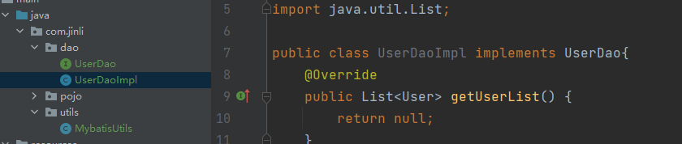
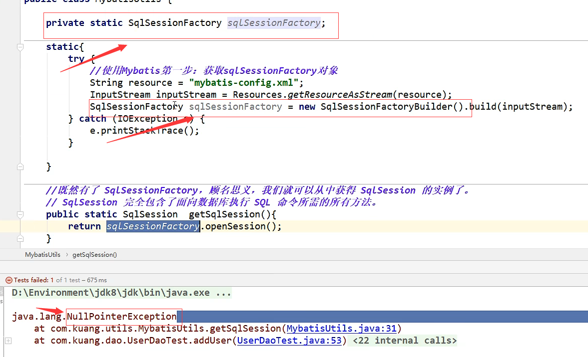

## 一、基础知识
### 1、编写mybatis工具类
```aidl
public class MybatisUtils {
    //提升作用域
    public static SqlSessionFactory sqlSessionFactory;
    static{
        try {
            //使用Mybatis第一步：获取sqlSessionFactory对象
            String resource = "mybatis-config.xml";
            InputStream inputStream = Resources.getResourceAsStream(resource);
            sqlSessionFactory = new SqlSessionFactoryBuilder().build(inputStream);
        } catch (IOException e) {
            throw new RuntimeException(e);
        }
    }

/**
 * 既然有了 SqlSessionFactory，顾名思义，我们可以从中获得 SqlSession 的实例。
 SqlSession 提供了在数据库执行 SQL 命令所需的所有方法。
 你可以通过 SqlSession 实例来直接执行已映射的 SQL 语句。**/

//创建一个可以执行sql语句的对象
    public static SqlSession getSession(){
        return sqlSessionFactory.openSession();;

    }
}
```
### 2、编写代码-实体类--->实体类的实现类
- 编写实体类
- 编写dao接口
- 编写dao接口实现类（调用接口实现类就可以去操作实体类了）

### 3、两种方法的对比
- 之前是写一个接口，编写一个实现类，引用jdbc的代码

- mybatis去掉了jdbc的手动配置
   
### 4、每一个Mapper.xml都需要在核心配置文件中注册
```aidl
    <mappers>
       <mapper class="com/jinli/mapper/UserMapper.xml"/>
    </mappers>
```
### 5、二种方式
```aidl
       //第二步、执行sql 
       //方式一：getMapper（）
        UserDao userDao = sqlSession.getMapper(UserDao.class);
        List<User> userList = userDao.getUserList();
      //方式二，sqlSession.selectList
       List<User> userList = sqlSession.selectList("com.jinli.dao.UserDao.getUserList");
```

### 6、三步走
- 1、先写工具类-（不用变）
- 2、去resources里面写mybatis-config.xml配置文件（以后可以不用改变）
- 3、写实体类（不用变）
- 4、写接口
- 5、写Mapper.xml
- 6、最后写test
- 7、配置maven
##  二、TIPS


### 7、具体实现步骤
1、编写实体类
```aidl
public class User {
    private int id;
    private String name;
    private String pwd;

    public User() {
    }

    public User(int id, String name, String pwd) {
        this.id = id;
        this.name = name;
        this.pwd = pwd;
    }

    public int getId() {
        return id;
    }

    public void setId(int id) {
        this.id = id;
    }

    public String getName() {
        return name;
    }

    public void setName(String name) {
        this.name = name;
    }

    public String getPwd() {
        return pwd;
    }

    public void setPwd(String pwd) {
        this.pwd = pwd;
    }

    //alt+ins 选择toString方法，全选全部的属性
    @Override
    public String toString() {
        return "User{" +
                "id=" + id +
                ", name='" + name + '\'' +
                ", pwd='" + pwd + '\'' +
                '}';
    }
}
```
2、编写接口
```aidl
  public interface UserDao {
      List<User> getUserList();
      User getUserId(int a); //User{id=1, name='Jinli', pwd='123'}
      //插入一个用户
      int insertUser(User user);
  
      int updateUser(User user);
  
      int deleteUser(int id);
  
  }

```
3、编写配置文件Mapper--CRUD(注意CRUD的标签：select、insert、update、delete)，参数类型
```aidl
<mapper namespace="com.jinli.dao.UserDao">
    <select id="getUserList" resultType="com.jinli.pojo.User">
        select * from mybatis.user
    </select>

    <select id="getUserId" parameterType="int" resultType="com.jinli.pojo.User">
        select * from mybatis.user where id = #{id}  <!--这里与变量id无关-->
    </select>

    <insert id="insertUser" parameterType="com.jinli.pojo.User">
        insert into mybatis.user(id,name,pwd) values (#{id},#{name},#{pwd});
    </insert>

    <update id="updateUser" parameterType="com.jinli.pojo.User">
        update mybatis.user set name=#{name},pwd=#{pwd} where id =#{id};
    </update>

    <delete id="deleteUser" parameterType="int">
        delete from mybatis.user where id =#{id};
    </delete>

</mapper>
```
4、编写CRUD测试类
```aidl
public class UserDaoTest {
    @Test
    public void test(){
        //第一步：获取sqlSession对象
        SqlSession sqlSession = MybatisUtils.getSqlSession();
        //第二步、执行sql  方式一：getMapper（）
        UserDao userDao = sqlSession.getMapper(UserDao.class);
        List<User> userList = userDao.getUserList();
        //方式二，sqlSession.selectList
//        List<User> userList = sqlSession.selectList("com.jinli.dao.UserDao.getUserList");
        for (User user : userList) {
            System.out.println(user);
        }
        //第三步：关闭资源
        sqlSession.close();
    }

    @Test
    public void getUserId(){
        SqlSession sqlSession = MybatisUtils.getSqlSession();
        UserDao userDao = sqlSession.getMapper(UserDao.class);
        User userId = userDao.getUserId(1);
        System.out.println(userId);
        sqlSession.close();
    }
    @Test
    public void insertUser(){
        SqlSession sqlSession = MybatisUtils.getSqlSession();
        UserDao mapper = sqlSession.getMapper(UserDao.class);
        int number = mapper.insertUser(new User(3,"lili","567"));
        if(number>0){
            System.out.println("用户添加成功");
        }

        //数据库事务的一致性,一定要commit()
        sqlSession.commit();
        sqlSession.close(); 
    }

    @Test
    public void updateUser(){
        SqlSession sqlSession = MybatisUtils.getSqlSession();
        UserDao mapper = sqlSession.getMapper(UserDao.class);
        int updateUser = mapper.updateUser(new User(3, "lph", "890")); //更新已有用户
        if(updateUser>0){
            System.out.println("更新用户成功 ");
        }


        sqlSession.commit();
        sqlSession.close();
    }

    @Test
    public void deleteUser(){
        SqlSession sqlSession = MybatisUtils.getSqlSession();
        UserDao mapper = sqlSession.getMapper(UserDao.class);
        int userNumber = mapper.deleteUser(3);
        if (userNumber>0){
            System.out.println("删除成功");
        }


        sqlSession.commit();
        sqlSession.close();

    }
}

```
```aidl
//提取模板
        SqlSession sqlSession = MybatisUtils.getSqlSession();
        UserDao mapper = sqlSession.getMapper(UserDao.class);
        sqlSession.commit(); //提交事务
        sqlSession.close();//关闭资源
```

### 5、resources里面mybatis-config.xml配置文件
```aidl
<!--每一个Mapper.xml都需要在核心配置文件中注册！-->
//这里的路径要写/或者\，有写.的时候，不是在这里
    <mappers>
        <mapper resource="com\jinli\dao\UserMapper.xml"/>
    </mappers>
```

##  三、Questions
### 1、mybatis可能会遇到的问题
- 配置文件没有注册
    - The error may exist in SQL Mapper Configuration //加入以下代码
    - ```aidl
    
         <build>
                <resources>
                    <resource>
                        <directory>src/main/resources</directory>
                        <includes>
                            <include>**/*.xml</include>
                        </includes>
                        <filtering>true</filtering>
                    </resource>
    
                <resource>
                    <directory>src/main/java</directory>
                    <includes>
                        <include>**/*.xml</include>
                    </includes>
                    <filtering>true</filtering>
                </resource>
      
            </resources>
        </build>


- 绑定接口错误
- 方法名不对
- 返回类型不对
- maven导出资源的问题

### 2、看看mysql数据库，有没有启动
- 报错数据库连不上
### 3、报错nullpointexception

正确：
外面的是全局变量，里面使用的是全局变量，初始值为null，而你又定义了一个局部变量，去掉第二步的SqlSessionFactory

排错：从下往上看

### 3、使用Map
- a、通过map可以随意制造参数，只传id或者name都是可以的，如果有的时候我们并不需要去修改用户的用户名和id的情况下，我们只传一个密码记好了，map就可以很好的实现这个功能
- b、如果通过对象，要把对象所有的属性都要写出来，就会非常冗余
- c、假设我们的实体类中的字段参数过多的情况下，我们应该过多的考虑map
- d、创建map对象：```Map<String, Object> map = new HashMap<String,Object>();```

```aidl
        //测试类
        Map<String, Object> map = new HashMap<String,Object>();
        HashMap<String,Object>();
        map.put("Userid",5);
        map.put("Username","JinLi");
        map.put("Userpwd","000");
        
        //xml配置
        <insert id="insertUser01" parameterType="map">
            insert into mybatis.user(id,pwd) values (#{Userid},#{Userpwd});
        </insert>
```